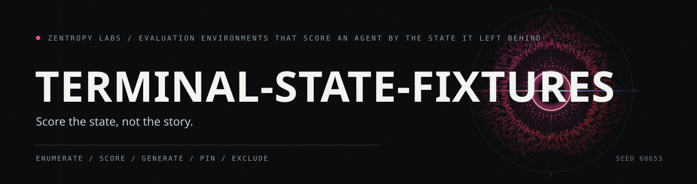

<picture>
  <source media="(prefers-color-scheme: dark)" srcset="https://raw.githubusercontent.com/HarperZ9/terminal-state-fixtures/main/docs/art/hero-dark.svg">
  
</picture>

# terminal-state-fixtures

Score AI agents by the state they leave, not by their transcript.

```
uv venv && uv pip install verifiers pytest
```

[](https://github.com/HarperZ9/terminal-state-fixtures/blob/main/LICENSE)




Evaluation environments that score an AI agent by the terminal state of its
work, not by what its transcript claims. Each environment ships an exhaustive
dataset, a deterministic reference scorer, and rewards whose discrimination is
pinned by tests, so every score is re-derivable on any machine.

## See it work, step by step

The [animated explainer](https://harperz9.github.io/repo-explainers/terminal-state-fixtures.html)
walks through the five-field run record enumerated into 324 rows, the eight-rule reference scorer, five records scored, the 23-row quality denominator, the two rewards, and the component-forge environment. Every value on it is output from this repository. Its
source is [docs/explainer/index.html](docs/explainer/index.html).

## Why terminal state

A transcript says what a model believes happened. The environment's terminal
state says what happened. When the two disagree, the terminal state wins, and
an evaluation built on it cannot be talked into a better score. The same
discipline covers the denominator: a provider outage or a blocked launch is
excluded from the quality denominator rather than counted as a failure, so a
regression in the numbers means a regression in the behavior.

## Environments

### mlflow-terminal-state


Classify agent-run records into seven terminal verdicts and decide which runs
belong in the quality denominator. 324 records, every reachable field
combination, no sampling. The public source is this repository. Version `0.1.1`
is staged privately on Prime Intellect's Environments Hub as
`zaindanaharper/mlflow-terminal-state`; it is not yet a public Hub release.

Load it directly:

```python
import mlflow_terminal_state

env = mlflow_terminal_state.load_environment()  # a verifiers SingleTurnEnv
dataset = mlflow_terminal_state.build_dataset()  # 324 rows, deterministic
```

After a public Hub release, install it from the Hub and evaluate with the
[verifiers](https://github.com/PrimeIntellect-ai/verifiers) toolchain. Until
then, use the public source in this repository.

Full task, dataset, and reward spec:
[environments/mlflow_terminal_state/README.md](environments/mlflow_terminal_state/README.md).

### verifiers-component-forge


Write and repair verifiers components against terminal-state contracts. The
environment includes parser-contract, rubric-contract, rubric-repair,
referee-protocol, and synthetic redaction contract families (337 cases,
~5,000 frozen probe comparisons). The repair family shows the agent one
mutated environment module plus its normative contract; credit concentrates
on hidden fixtures that distinguish broken from repaired behavior, so
returning the broken module verbatim scores at most the frozen regression
share. The referee-protocol family has the agent build a deterministic
multiturn referee; scoring replays canned player scripts through the real
MultiTurnEnv rollout loop and compares transcripts, rewards, and stop
reasons, with an independent pure fold of each state machine cross-checking
every frozen expectation. The redaction family uses fake secret markers
only, scores terminal JSON output, and pins that expected outputs preserve
public metadata while removing every raw marker value.

Reproduce:
[environments/verifiers-component-forge/REPRODUCE.md](environments/verifiers-component-forge/REPRODUCE.md).

## The claims are tests


The spec's validation claims are pinned in
[environments/mlflow_terminal_state/tests](environments/mlflow_terminal_state/tests):
the dataset is exhaustive and builds identically twice, correct answers score
1.0, wrong verdicts and garbage score 0.0, integrity beats the oracle, and a
missing oracle is an honest null rather than a pass.

```bash
cd environments/mlflow_terminal_state
uv venv && uv pip install verifiers pytest
uv run pytest tests/ -q
```

The component-forge claims are pinned in
[environments/verifiers-component-forge/tests](environments/verifiers-component-forge/tests):
frozen data regenerates deterministically, reference components score 1.0,
known-bad implementations fail, and redacted expected outputs contain no raw
synthetic secret markers.

## Reusing the pattern

To build a terminal-state environment for another tool: enumerate the reachable
states of the thing being scored, write the reference scorer first, generate the
dataset from the scorer so ground truth is re-derivable, then pin the scorer's
subtle cases and the rewards' discrimination as tests. The environment here is
small enough to read in one sitting and serves as the worked example.

One environment is public-source and staged privately on the Hub today. More
follow as they clear the same publication bar.
